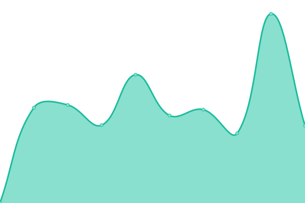

# [📈 Live Status](https://status.iprtapp.com): <!--live status--> **🟧 Partial outage**

This repository contains the open-source uptime monitor and status page for [0xfe10](https://status.iprtapp.com), powered by [Upptime](https://github.com/upptime/upptime).

With [Upptime](https://upptime.js.org), you can get your own unlimited and free uptime monitor and status page, powered entirely by a GitHub repository. We use [Issues](https://github.com/0xfe10/upptime-ayn/issues) as incident reports, [Actions](https://github.com/0xfe10/upptime-ayn/actions) as uptime monitors, and [Pages](https://status.iprtapp.com) for the status page.

<!--start: status pages-->
<!-- This summary is generated by Upptime (https://github.com/upptime/upptime) -->
<!-- Do not edit this manually, your changes will be overwritten -->
<!-- prettier-ignore -->
| URL | Status | History | Response Time | Uptime |
| --- | ------ | ------- | ------------- | ------ |
|  LabelExpert-PRD | 🟩 Up | [label-expert-prd.yml](https://github.com/0xfe10/upptime-ayn/commits/HEAD/history/label-expert-prd.yml) | 

 1111ms
     
 | 

<a href="https://status.iprtapp.com/history/label-expert-prd">99.75%</a>
    

|  LabelExpert-STG | 🟥 Down | [label-expert-stg.yml](https://github.com/0xfe10/upptime-ayn/commits/HEAD/history/label-expert-stg.yml) | 

 947ms
     
 | 

<a href="https://status.iprtapp.com/history/label-expert-stg">22.79%</a>
    

|  Aiyin-PRD | 🟨 Degraded | [aiyin-prd.yml](https://github.com/0xfe10/upptime-ayn/commits/HEAD/history/aiyin-prd.yml) | 

 9712ms
     
 | 

<a href="https://status.iprtapp.com/history/aiyin-prd">81.93%</a>
    

|  Aiyin-STG | 🟥 Down | [aiyin-stg.yml](https://github.com/0xfe10/upptime-ayn/commits/HEAD/history/aiyin-stg.yml) | 

 1314ms
     
 | 

<a href="https://status.iprtapp.com/history/aiyin-stg">23.18%</a>
    

|  Analysis-PRD | 🟩 Up | [analysis-prd.yml](https://github.com/0xfe10/upptime-ayn/commits/HEAD/history/analysis-prd.yml) | 

 854ms
     
 | 

<a href="https://status.iprtapp.com/history/analysis-prd">100.00%</a>
    

|  Analysis-STG | 🟩 Up | [analysis-stg.yml](https://github.com/0xfe10/upptime-ayn/commits/HEAD/history/analysis-stg.yml) | 

 326ms
     
 | 

<a href="https://status.iprtapp.com/history/analysis-stg">100.00%</a>
    

<!--end: status pages-->

[**Visit our status website →**](https://status.iprtapp.com)

## 📄 License

- Powered by: [Upptime](https://github.com/upptime/upptime)
- Code: [MIT](./LICENSE) © [Anand Chowdhary](https://anandchowdhary.com), supported by [Pabio](https://pabio.com)
- Data in the `./history` directory: [Open Database License](https://opendatacommons.org/licenses/odbl/1-0/)
